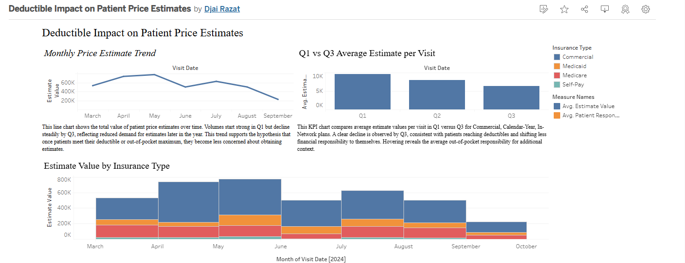

# Deductible Impact Analysis (SQL + Tableau)

**Goal:** Investigate why patient price estimate requests decline later in the year (deductible/OOP hypothesis).

**Data:** Semi-Synthetic dataset (521 rows, ~$3.9M). Fields include VisitDate, InsuranceType, PlanYearType, PayerName, NetworkStatus, ServiceCategory, EstimateValue, InsuranceCovered, PatientResponsibility, DeductiblePortion, CopayPortion, CoinsurancePortion.

**Tools:** Google BigQuery (SQL), Tableau Public.

## Key Findings
- Average estimate per visit declines from Q1→Q3 for Commercial, Calendar-Year, In-Network.
- Advanced Imaging & Surgery show the highest copays; many visits exceed $250.
- Patient OOP declines over time as deductibles are met and insurers cover more.

## Repo Contents
- **SQL:** [/sql/patient_estimate_analysis.sql](sql/patient_estimate_analysis.sql)
- **Data:** [/data/](data/)
- **Summary:** [/docs/project_summary.md](docs/project_summary.md)
- **Dashboard:** see [/links/tableau_public_url.txt](links/tableau_public_url.txt)

